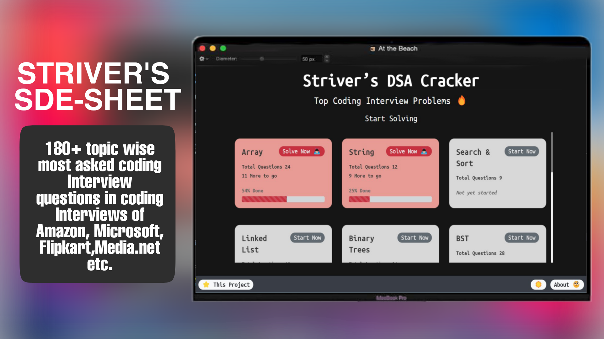

# SDE-SHEET 🚀

## Overview 👀

- **Topic wise question search 🔍**
- **Topic wise progress 🧐**
- **Complete local storage 📂**
- **Desktop first design ✌🏻**
- **Clean UI ⚡**

## What is SDE-SHEET Cracker 🤔

#### SDE Sheet contains very handily crafted and picked top coding interview questions from different topics of Data Structures & Algorithms. These questions are one of the most asked coding interview questions in coding interviews of companies like Amazon, Microsoft, Media.net, Flipkart, etc, and cover almost all of the concepts related to Data Structure & Algorithms.

#### SDE-SHEET doesn't guarantee a job but guarantees your confidence in solving any coding problem if done in the right way 👍🏻.

#### More details on how [sde-sheet] can help you -> [here].

#### 

## Why trust the Striver SDE sheet ⁉️

#### This is sheet is prepared by Raj Vikramaditya A.K.A Striver, Candidate Master, 6*, who has bagged offers from Google Warsaw, Facebook London, Media.net(Directi). #### He has also interned at Amazon India. He is also one of the top educators at Unacademy and was at GeeksforGeeks as well. Not only this, hundreds of students cleared interviews of top companies with the help of this sheet. What are you waiting for?

## Dependencies 🗃

- [React] - **Frontend Framework**
- [Bootstrap] - **CSS Framework**
- [React-Reveal] - **React Based Animations**
- [React-Table-2] - **Suite of table hooks**
- [LocalBase] - **Firebase style DB for offline storage**

## Credits 🙏🏻

#### Curated list of question in [sde-sheet] is based on _[Striver’s SDE Sheet]_ by [Raj Vikramaditya]
#### The project is inspired from [Ashish-Raju]

[here]: https://youtu.be/WNtzUR_MwUQ
[sde-sheet]: https://takeuforward.org/interviews/strivers-sde-sheet-top-coding-interview-problems/
[Raj Vikramaditya]: https://www.linkedin.com/in/rajarvp/
[localbase]: https://github.com/dannyconnell/localbase
[Ashish-Raju]: https://www.linkedin.com/in/asishraju/
[react-reveal]: https://www.react-reveal.com/
[bootstrap]: https://react-bootstrap.github.io/
[react]: https://reactjs.org/
[react-table-2]: https://react-bootstrap-table.github.io/react-bootstrap-table2/
